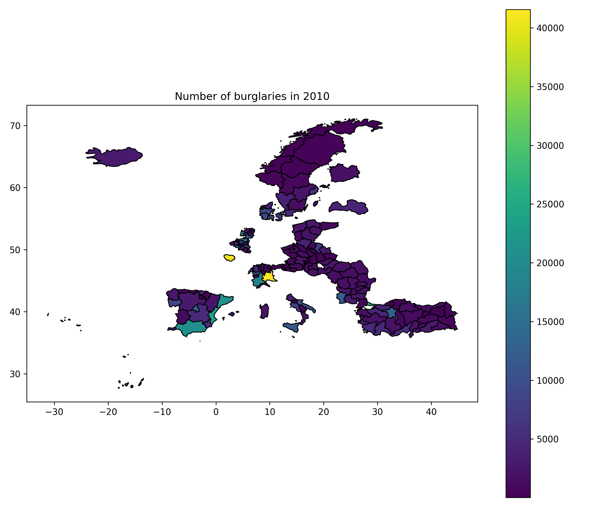
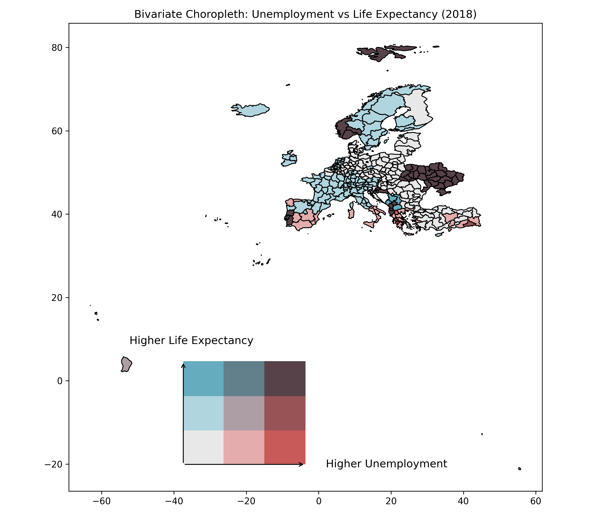

# mapineqpy


<!-- README.md is generated from README.qmd. Please edit that file -->

# mapineqpy

<!-- badges: start -->

[](https://lifecycle.r-lib.org/articles/stages.html#experimental)
<!-- badges: end -->

The goal of `mapineqpy` is to access the data from the [Mapineq.org
API](https://www.mapineq.org/data-users/) and
[dashboard](https://dashboard.mapineq.org/datacatalogue) (product of the
[Mapineq](https://mapineq.eu/) project). For R package, see
<https://github.com/e-kotov/mapineqr> and
<https://www.ekotov.pro/mapineqr>.

## Installation

Install the development version of `mapineqpy` from GitHub:

``` bash
pip install git+https://github.com/e-kotov/mapineqpy.git
```

## Basic Example - Univariate Data and Maps

1.  Get the full list of available data at NUTS 3 level:

``` python
import mapineqpy as mi

available_data = mi.sources(level="3")
print(available_data.head())
```

         source_name     short_description                                        description
    0   DEMO_R_D3AREA       Area of regions                      Area by NUTS 3 region (ESTAT)
    1  PROJ_19RAASFR3  Fertility assumption  Assumptions for fertility rates by age, type o...
    2  PROJ_19RAASMR3     Death assumptions  Assumptions for probability of dying by age, s...
    3   BD_HGNACE2_R3  Business demography   Business demography and high growth enterprise...
    4      BD_SIZE_R3  Business demography   Business demography by size class and NUTS 3 r...

2.  Select data source by `source_name` column and check its year and
    NUTS level coverage:

``` python
coverage = mi.source_coverage("CRIM_GEN_REG")
print(coverage)
```

    nuts_level  year   source_name short_description                                        description
    0           0  2008  CRIM_GEN_REG   Settlement type  Satellite-based settlement types based on imagery
    1           0  2009  CRIM_GEN_REG   Settlement type  Satellite-based settlement types based on imagery
    2           0  2010  CRIM_GEN_REG   Settlement type  Satellite-based settlement types based on imagery
    3           1  2008  CRIM_GEN_REG   Settlement type  Satellite-based settlement types based on imagery
    4           1  2009  CRIM_GEN_REG   Settlement type  Satellite-based settlement types based on imagery
    5           1  2010  CRIM_GEN_REG   Settlement type  Satellite-based settlement types based on imagery
    6           2  2008  CRIM_GEN_REG   Settlement type  Satellite-based settlement types based on imagery
    7           2  2009  CRIM_GEN_REG   Settlement type  Satellite-based settlement types based on imagery
    8           2  2010  CRIM_GEN_REG   Settlement type  Satellite-based settlement types based on imagery
    9           3  2008  CRIM_GEN_REG   Settlement type  Satellite-based settlement types based on imagery
    10          3  2009  CRIM_GEN_REG   Settlement type  Satellite-based settlement types based on imagery
    11          3  2010  CRIM_GEN_REG   Settlement type  Satellite-based settlement types based on imagery

3.  Check the available filters for the data source:

``` python
filters = mi.source_filters("CRIM_GEN_REG", year=2010, level="2")
print(filters)
```

     field                                        field_label                                     label       value
    0  unit                                    Unit of measure                                    Number          NR
    1  freq                                     Time frequency                                    Annual           A
    2  iccs  International classification of crime for stat...                      Intentional homicide    ICCS0101
    3  iccs  International classification of crime for stat...                                   Robbery    ICCS0401
    4  iccs  International classification of crime for stat...  Burglary of private residential premises   ICCS05012
    5  iccs  International classification of crime for stat...         Theft of a motorized land vehicle  ICCS050211

4.  Choose the indicator to filter (let it be burglaries) and get the
    data:

``` python
data = mi.data(
    x_source="CRIM_GEN_REG",
    year=2010,
    level="2",
    x_filters={"iccs": "ICCS05012"}
)
print(data.head())
```

      geo          geo_name best_year       x
    0  AT11    Burgenland (A)      2008   223.0
    1  AT12  Niederösterreich      2008  2557.0
    2  AT13              Wien      2008  9319.0
    3  AT21           Kärnten      2008   507.0
    4  AT22        Steiermark      2008  1163.0

5.  Map the indicator using NUTS2 polygons:

5.1 Get the NUTS2 level data:

``` python
from gisco_geodata import (
    NUTS,
    set_httpx_args
)
from eurostat import (
    get_data_df,
    get_toc_df,
    set_requests_args
)
import geopandas as gpd
import matplotlib.pyplot as plt

import nest_asyncio
nest_asyncio.apply()
set_httpx_args(verify=False)
set_requests_args(verify=False)
nuts = NUTS()
nuts2 = nuts.get(spatial_type='RG', nuts_level='LEVL_2')
```

5.2 Join the data with NUTS2 polygons and plot a map:

``` python
import matplotlib.pyplot as plt

# Join the data with NUTS2 polygons
nuts2 = nuts2.merge(data, left_on="NUTS_ID", right_on="geo", how="left")

# Plot a map of burglaries
fig, ax = plt.subplots(1, 1, figsize=(10, 8))
nuts2.plot(column="x", ax=ax, legend=True, cmap="viridis", edgecolor="black")
plt.title("Number of burglaries in 2010")
plt.savefig("docs/figures/map_burglaries.png", dpi=300)
```



## Advanced Example - Bivariate Data and Maps

1.  Get the data for two indicators (e.g., unemployment rate and life
    expectancy):

``` python
xy_data = mi.data(
    year=2018,
    level="2",
    x_source="TGS00010",
    x_filters={"isced11": "TOTAL", "unit": "PC", "age": "Y_GE15", "sex": "T", "freq": "A"},
    y_source="DEMO_R_MLIFEXP",
    y_filters={"unit": "YR", "age": "Y_LT1", "sex": "T", "freq": "A"}
)
print(xy_data.head())
```

       geo          geo_name best_year    x     y
    0  AL01              Veri      2018  NaN   NaN
    1  AL02            Qender      2018  NaN   NaN
    2  AL03               Jug      2018  NaN   NaN
    3  AT11        Burgenland      2018  4.2  81.5
    4  AT12  Niederösterreich      2018  3.8  81.5

2.  Plot a scatterplot:

``` python
import seaborn as sns
import matplotlib.pyplot as plt

# Start a new figure
plt.figure()

# Create the scatterplot
sns.scatterplot(data=xy_data, x="x", y="y")

# Add labels and title
plt.xlabel("Unemployment Rate (%)")
plt.ylabel("Life Expectancy")
plt.title("Unemployment vs Life Expectancy")

# Save the plot
plt.savefig("docs/figures/edu_vs_life_exp_plot.png", dpi=300)
```


3.  Add the bivariate data to the NUTS2 polygons and create a map:

``` python
nuts2 = nuts.get(spatial_type='RG', nuts_level='LEVL_2')
nuts2 = nuts2.merge(xy_data, left_on="NUTS_ID", right_on="geo", how="left")
```

Thanks to https://github.com/mikhailsirenko/bivariate-choropleth for the
code for bivariate map.

``` python
from mapclassify import Quantiles
from sklearn.preprocessing import MinMaxScaler
import numpy as np
from matplotlib.colors import ListedColormap

# Initialize MinMaxScaler
scaler = MinMaxScaler()

# Scale the `x` and `y` variables
nuts2['x_scaled'] = scaler.fit_transform(nuts2[['x']])
nuts2['y_scaled'] = scaler.fit_transform(nuts2[['y']])
```

``` python
import matplotlib.pyplot as plt
import matplotlib.colors as mcolors
import pandas as pd

# Define the bivariate colormap
all_colors = [
    "#e8e8e8", "#b0d5df", "#64acbe",  # Low Y (1st row)
    "#e4acac", "#ad9ea5", "#627f8c",  # Mid Y (2nd row)
    "#c85a5a", "#985356", "#574249",  # High Y (3rd row)
]
cmap = mcolors.ListedColormap(all_colors)

# Binning variables for bivariate classification
bins = [0, 0.33, 0.66, 1]
nuts2['Var1_Class'] = pd.cut(nuts2['x_scaled'], bins=bins, labels=["1", "2", "3"], include_lowest=True)
nuts2['Var2_Class'] = pd.cut(nuts2['y_scaled'], bins=bins, labels=["A", "B", "C"], include_lowest=True)
nuts2['Bi_Class'] = nuts2['Var1_Class'].astype(str) + nuts2['Var2_Class'].astype(str)

# Filter the colormap to match present classes
present_classes = nuts2['Bi_Class'].unique()
filtered_colors = [
    color for cls, color in zip(
        ['1A', '1B', '1C', '2A', '2B', '2C', '3A', '3B', '3C'], all_colors
    ) if cls in present_classes
]
filtered_cmap = mcolors.ListedColormap(filtered_colors)

# Plot the bivariate map
fig, ax = plt.subplots(1, 1, figsize=(10, 8))
nuts2.plot(column="Bi_Class", ax=ax, cmap=filtered_cmap, edgecolor="black", legend=False)
plt.title("Bivariate Choropleth: Unemployment vs Life Expectancy (2018)")

# Add the bivariate legend
legend_ax = fig.add_axes([0.3, 0.1, 0.2, 0.2])  # Position and size of the legend
legend_ax.set_xlim(0, 3)
legend_ax.set_ylim(0, 3)

# Draw legend squares
for i in range(3):
    for j in range(3):
        legend_ax.add_patch(plt.Rectangle((i, j), 1, 1, color=all_colors[i * 3 + j]))

# Add arrows for axes
legend_ax.annotate("", xy=(3, 0), xytext=(0, 0), arrowprops=dict(arrowstyle="->", lw=1))
legend_ax.annotate("", xy=(0, 3), xytext=(0, 0), arrowprops=dict(arrowstyle="->", lw=1))

# Add axis labels
legend_ax.text(3.5, 0, "Higher Unemployment", va="center", fontsize=12)
legend_ax.text(.2, 3.5, "Higher Life Expectancy", ha="center", fontsize=12, rotation=0)

legend_ax.axis("off")  # Turn off the axis for a clean legend

# Save the map
# plt.savefig("bivariate_choropleth_with_legend.png", dpi=300)
plt.savefig("docs/figures/edu_vs_life_exp_map.png", dpi=300)
```



## Citation

To cite `mapineqpy` and the data/API, please use:

Kotov E. “mapineqpy: A Python package for accessing Mapineq API data.”
2024. Available at: https://github.com/e-kotov/mapineqpy

Mills M, Leasure D (2024). “Mapineq Link: Geospatial Dashboard and
Database.” doi:10.5281/zenodo.13864000
<https://doi.org/10.5281/zenodo.13864000>.
